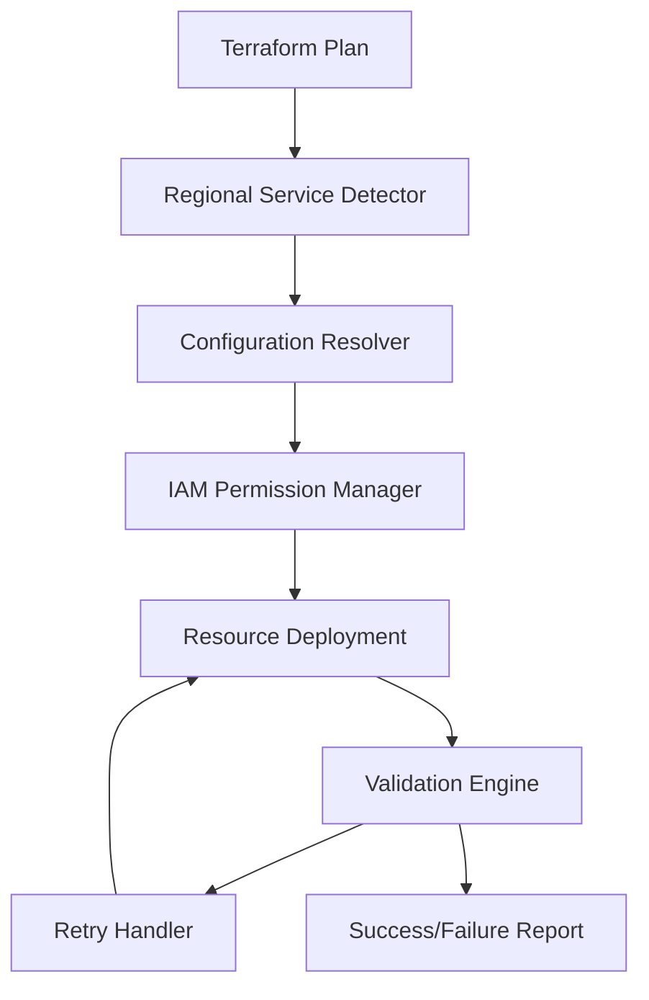

# Design Document

## Overview

This design addresses the systematic resolution of AWS security service deployment issues in the Terraform configuration. The solution implements a multi-layered approach that includes proper IAM permission management, regional service detection, robust error handling, and dynamic configuration based on AWS region capabilities.

## Architecture

### Core Components

1. **IAM Permission Manager** - Handles dynamic IAM policy creation with minimum required permissions
2. **Regional Service Detector** - Validates service availability and capabilities per region
3. **Configuration Resolver** - Dynamically resolves region-specific ARNs and configurations
4. **Retry Handler** - Implements exponential backoff for transient failures
5. **Validation Engine** - Verifies successful deployment and configuration

### Component Interactions



## Components and Interfaces

### 1. IAM Permission Manager

**Purpose:** Creates and manages IAM policies with minimum required permissions for each security service.

**Interface:**
- Input: Service type, region, account ID
- Output: IAM policy JSON, role ARNs
- Methods: `create_guardduty_policy()`, `create_inspector_policy()`, `create_security_hub_policy()`

**Implementation Details:**
- Uses data sources to fetch current account and region information
- Implements conditional policy statements based on enabled features
- Creates service-linked roles where required
- Validates permissions before resource creation

### 2. Regional Service Detector

**Purpose:** Detects available AWS services and their capabilities in the target region.

**Interface:**
- Input: AWS region, service list
- Output: Service availability map, capability matrix
- Methods: `check_service_availability()`, `get_regional_limits()`

**Implementation Details:**
- Uses AWS APIs to query service availability
- Maintains a lookup table of known regional limitations
- Provides fallback configurations for unsupported features
- Caches results to avoid repeated API calls

### 3. Configuration Resolver

**Purpose:** Dynamically resolves region-specific configurations and ARNs.

**Interface:**
- Input: Region, service type, standard/feature name
- Output: Resolved ARN, configuration parameters
- Methods: `resolve_security_hub_arn()`, `get_inspector_config()`, `build_guardduty_config()`

**Implementation Details:**
- Maintains region-to-ARN mapping for Security Hub standards
- Constructs proper ARN formats based on partition and region
- Handles special cases for GovCloud and China regions
- Validates ARN format before returning

### 4. Retry Handler

**Purpose:** Implements robust retry mechanisms for transient AWS API failures.

**Interface:**
- Input: Resource configuration, retry parameters
- Output: Success/failure status, error details
- Methods: `retry_with_backoff()`, `is_retryable_error()`, `get_retry_delay()`

**Implementation Details:**
- Exponential backoff with jitter
- Different retry strategies for different error types
- Maximum retry limits to prevent infinite loops
- Detailed logging of retry attempts

### 5. Validation Engine

**Purpose:** Validates successful deployment and configuration of security services.

**Interface:**
- Input: Resource IDs, expected configuration
- Output: Validation results, compliance status
- Methods: `validate_guardduty()`, `validate_inspector()`, `validate_security_hub()`

**Implementation Details:**
- Post-deployment validation checks
- Configuration drift detection
- Service health monitoring
- Compliance verification

## Data Models

### Service Configuration Model
```hcl
variable "security_services_config" {
  type = object({
    guardduty = object({
      enable_malware_protection = bool
      enable_ebs_scanning       = bool
      retention_days           = number
      s3_bucket_name          = string
    })
    inspector = object({
      enable_ecr_scanning    = bool
      enable_lambda_scanning = bool
      enable_ec2_scanning    = bool
    })
    security_hub = object({
      enable_aws_foundational = bool
      enable_cis_benchmark    = bool
      enable_nist_800_53     = bool
    })
  })
}
```

### Regional Capability Model
```hcl
locals {
  regional_capabilities = {
    "us-east-1" = {
      guardduty_malware_protection = true
      inspector_ecr_scanning      = true
      inspector_lambda_scanning   = true
      security_hub_standards = [
        "aws-foundational-security-best-practices/v/1.0.0",
        "cis-aws-foundations-benchmark/v/1.4.0",
        "nist-800-53/v/5.0.0"
      ]
    }
    "eu-west-1" = {
      guardduty_malware_protection = true
      inspector_ecr_scanning      = true
      inspector_lambda_scanning   = false  # Known timeout issues
      security_hub_standards = [
        "aws-foundational-security-best-practices/v/1.0.0",
        "cis-aws-foundations-benchmark/v/1.4.0"
      ]
    }
  }
}
```

## Error Handling

### Error Categories and Responses

1. **Permission Errors**
   - Detection: IAM policy simulation
   - Response: Create missing permissions, provide remediation steps
   - Fallback: Disable feature with warning

2. **Regional Availability Errors**
   - Detection: Service availability check
   - Response: Skip unsupported features, log warnings
   - Fallback: Use alternative configurations

3. **Timeout Errors**
   - Detection: API timeout responses
   - Response: Retry with exponential backoff
   - Fallback: Manual intervention guidance

4. **Resource Limit Errors**
   - Detection: Quota exceeded responses
   - Response: Request limit increase, provide guidance
   - Fallback: Reduce resource allocation

### Retry Strategy Implementation

```hcl
resource "aws_inspector2_enabler" "ecr" {
  count = local.regional_capabilities[var.aws_region].inspector_ecr_scanning ? 1 : 0
  
  account_ids    = [data.aws_caller_identity.current.account_id]
  resource_types = ["ECR"]
  
  timeouts {
    create = "10m"
    update = "10m"
    delete = "10m"
  }
  
  lifecycle {
    create_before_destroy = true
    ignore_changes = [
      # Ignore changes that might cause unnecessary updates
    ]
  }
}
```

## Testing Strategy

### Unit Tests
- IAM policy validation
- ARN construction logic
- Regional capability detection
- Configuration resolution

### Integration Tests
- End-to-end deployment in multiple regions
- Service integration validation
- Error handling scenarios
- Rollback procedures

### Validation Tests
- Post-deployment configuration verification
- Security compliance checks
- Performance impact assessment
- Cost optimization validation

### Test Environments
- Development: us-east-1 (full feature support)
- Staging: eu-west-1 (limited feature support)
- Production: Multi-region deployment

## Implementation Phases

### Phase 1: IAM Permission Resolution
- Create comprehensive IAM policies for all services
- Implement permission validation
- Add service-linked role creation

### Phase 2: Regional Configuration
- Implement regional capability detection
- Create dynamic ARN resolution
- Add regional fallback configurations

### Phase 3: Error Handling and Retry Logic
- Implement retry mechanisms
- Add comprehensive error handling
- Create validation and monitoring

### Phase 4: Testing and Validation
- Comprehensive testing across regions
- Performance optimization
- Documentation and runbooks

## Security Considerations

- All IAM policies follow principle of least privilege
- KMS encryption for all data at rest
- Secure transport (TLS) for all API communications
- Regular security compliance validation
- Audit logging for all configuration changes

## Performance Considerations

- Parallel resource creation where possible
- Efficient retry mechanisms to minimize deployment time
- Caching of regional capability data
- Optimized dependency management

## Monitoring and Alerting

- CloudWatch metrics for deployment success/failure
- SNS notifications for critical errors
- CloudTrail logging for audit purposes
- Custom metrics for service health monitoring